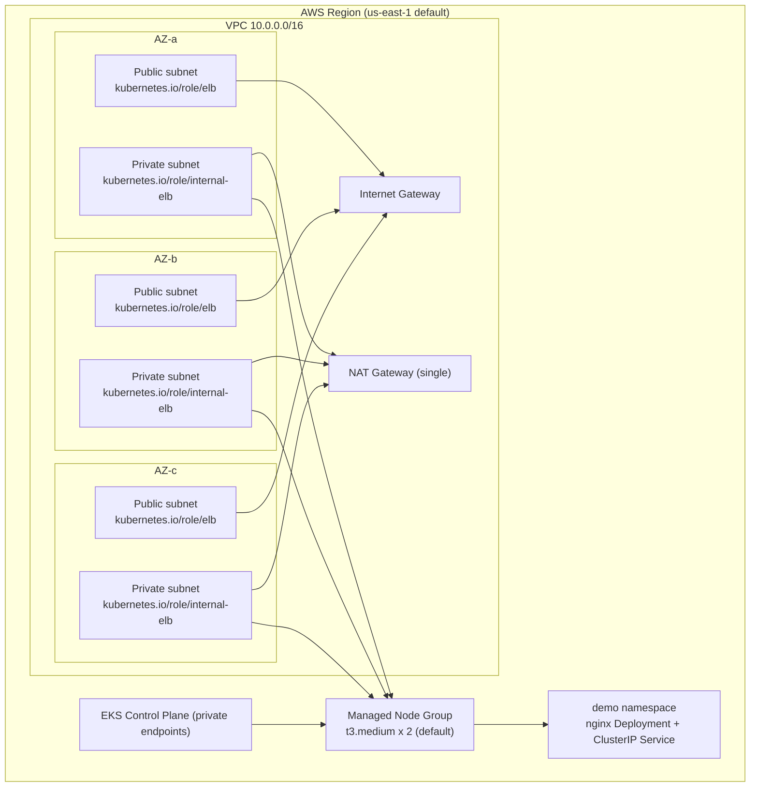

# terraform-aws-eks-blueprint

A production-style Terraform blueprint that provisions a complete Amazon EKS cluster with a dedicated VPC, a single NAT gateway, an EKS-managed node group, IAM roles for service accounts (IRSA), and core cluster add-ons. Built as a reference architecture for provisioning Kubernetes on AWS the repeatable, version-controlled way.

## Why this matters

Provisioning Kubernetes by hand invites drift: untracked subnets, unpatched add-ons, and IAM roles that nobody remembers creating. This blueprint encodes the whole platform in code, so every environment is created the same way, every change is reviewed in a pull request, and nothing exists outside of version control. It follows community-standard module patterns (terraform-aws-modules) rather than hand-rolled resources, which keeps upgrades boring and maintenance cheap.

## Architecture



The VPC spans three availability zones with public subnets (for the NAT gateway and internet-facing load balancers) and private subnets (for worker nodes and cluster networking). The EKS control plane and managed node group live entirely in the private subnets. Node groups carry the IAM policy for the EBS CSI driver, and IRSA is enabled so Kubernetes service accounts can assume AWS IAM roles without long-lived credentials.

## Prerequisites

- Terraform >= 1.5.0
- AWS CLI v2 installed and configured with credentials that can create IAM roles, VPC networking, and EKS clusters
- kubectl (for deploying the demo workload)
- An S3 bucket and DynamoDB table if you want remote state locking (recommended for team use)

## Usage

1. Clone the repository and move into the project directory:

```bash
cd terraform-aws-eks-blueprint
```

2. Initialize Terraform (downloads the provider and community modules):

```bash
terraform init
```

3. Review the planned changes:

```bash
terraform plan -var="project=demo" -var="environment=dev"
```

4. Apply the plan and wait for the cluster to become active (usually 15-20 minutes):

```bash
terraform apply -var="project=demo" -var="environment=dev"
```

5. Point kubectl at the new cluster:

```bash
aws eks update-kubeconfig --name demo-dev --region us-east-1
```

6. Deploy the sample workload to verify the cluster:

```bash
kubectl apply -f workloads/demo-app.yaml
kubectl get pods -n demo
```

## Cost notes

Running this blueprint incurs real AWS charges while resources exist:

- NAT gateway: billed per hour plus per-GB data processing fees. This blueprint uses a single NAT gateway (rather than one per AZ) to keep that cost down for dev and demo environments.
- EBS volumes: the EBS CSI add-on is installed, and any PersistentVolumeClaim you create provisions EBS volumes that are billed per GB-month, even when pods are idle.
- EC2 worker nodes: the default t3.medium node group runs 2 nodes around the clock. Reduce node_desired_size to 1 or 0 when the cluster is not in use.

Shut the environment down when you are done with it; see Cleanup below.

## Cleanup

Destroy everything created by the blueprint to stop all charges:

```bash
terraform destroy -var="project=demo" -var="environment=dev"
```

Confirm the plan shows zero resources remaining, and verify in the AWS console that the VPC, NAT gateway, and cluster are gone before closing the ticket.

## File layout

- versions.tf: Terraform version constraint and AWS provider pin
- variables.tf: all input variables with descriptions and defaults
- main.tf: VPC module, EKS module, AZ data source, and locals
- outputs.tf: cluster name, endpoint, OIDC issuer URL, VPC ID, and private subnets
- workloads/demo-app.yaml: sample nginx Deployment and ClusterIP Service in the demo namespace
- .github/workflows/terraform.yml: CI workflow that plans on pull requests and applies on pushes to main

## Notes

- The workflow assumes OIDC federation: create an IAM role that trusts your GitHub repository and store its ARN in the AWS_ROLE_TO_ASSUME secret, with the region in the AWS_REGION repository variable.
- Cluster endpoint public access is enabled for simplicity in this reference architecture. For a production setup, restrict access to a bastion host or VPN CIDR range.
